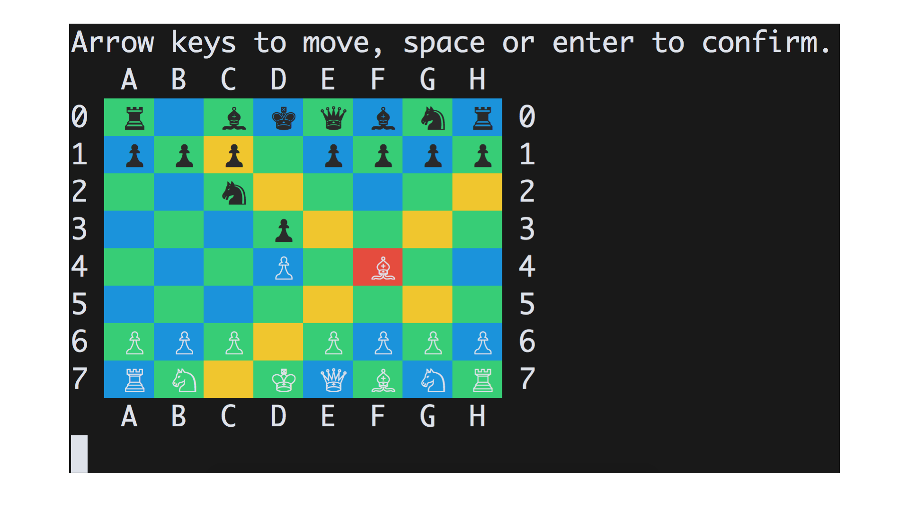
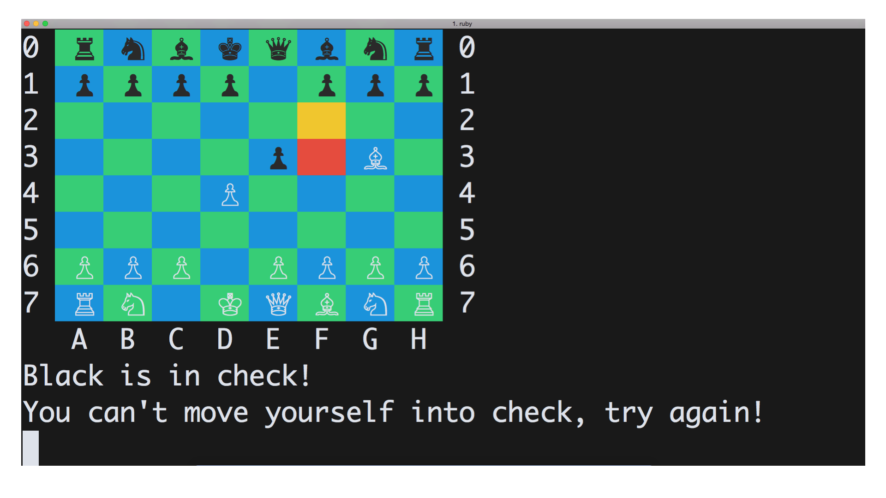
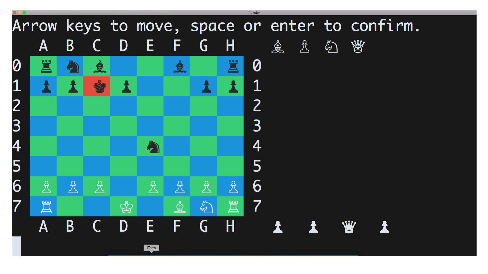

# Chess

I am an absolutely chess geek. You can look up my USCF profile on www.uschess.org and search for Wu, Theodore L.

### How to Play
1. Make sure you have Ruby installed. Check out this [tutorial] (www.installrails.com).
2. Fire up the terminal and open the chess repository.
3. Install the 'colorize' gem.
4. Type in: $ ruby chess.rb . And you are ready to play.

### Basic Concepts
Multi-level class inheritance and DRY code facilitates the process for
* Highlighting a piece's valid moves
<br>
* Handling a variety of errors, such as an illegal move, a move in check, or not-your-turn move.
<br> 
* Storing captured pieces
<br> 

### The Cooler Stuff: Building out the AI

* If the King is in check...
  - For the first move that gets the computer out of check, move there. Don't move the king unless you absolutely have to.
  ```
  if @board.check?(:black)
    move_king_at_last_resort = []
    @board.pieces(:black).each do |piece|
      piece.moves.each do |move|
        dup_board = @board.dup
        dup_board.move!(piece.position, move)
        unless (dup_board.check?(:black))
          if piece.is_a?(King)
            move_king_at_last_resort = [piece.position,move]
          else
            return [piece.position,move]
          end
        end
      end
    end
    move_king_at_last_resort
  ```
* Are there any pieces to capture?
  - If there is more than one piece to capture, capture the piece with the highest value.
  Pawn = 1; Knight/Bishop = 3; Rook = 5; Queen = 10;
  ```
  @board.pieces(:black).each do |piece|
    piece.moves.each do |move|
      point_value = 0
      current_piece = @board[move]
      unless current_piece.is_a?(EmptyPiece) && current_piece.color == :white
        if current_piece.is_a?(Pawn)
          point_value = 1
        elsif current_piece.is_a?(Knight) || current_piece.is_a?(Bishop)
          point_value = 3
        elsif current_piece.is_a?(Rook)
          point_value = 5
        elsif current_piece.is_a?(Queen)
          point_value = 10
        end
  ```
* If there are no pieces to capture...
  - Move the piece that gets you closest to the king.
  ```
  king_pos = @board.find_king(:white)
  closest_to = nil
  closest_diff = 0

  @board.pieces(:black).each do |piece|
    piece.moves.each do |move|
      if closest_to.nil?
        closest_to = [piece.position, move]
        closest_diff = (king_pos[0] - move[0]).abs + (king_pos[1] - move[1]).abs
        break
      end
      change = (king_pos[0] - move[0]).abs + (king_pos[1] - move[1]).abs
      if change < closest_diff
        closest_diff = change
        closest_to = [piece.position, move]
      end
    end
  end
  ```

### Features to be Implemented
* Add another layer for the AI to think two steps head
* Write a method for the AI to determine checkmate game-winning move
* Add en passant.
